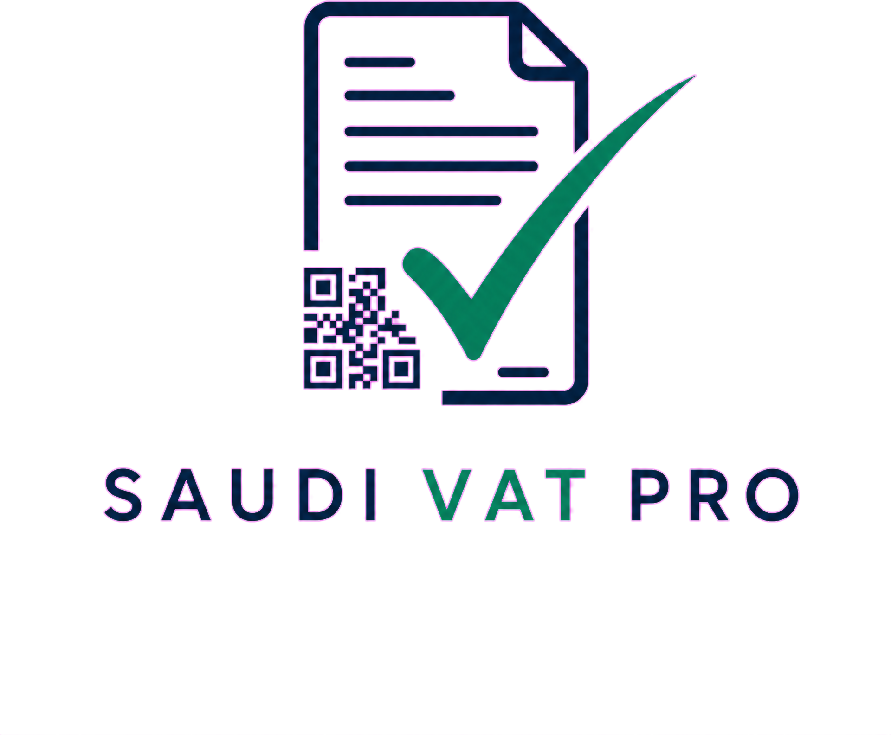

<p align="center">
  
</p>

# Saudi VAT Pro — ZATCA Phase 2 E-Invoicing

[](https://www.gnu.org/licenses/gpl-2.0)
[](https://saudivat.pro)
[](https://zatca.gov.sa)

**[saudivat.pro](https://saudivat.pro)** automates ZATCA Phase 2 e-invoicing for Saudi Arabian businesses — WooCommerce stores, Shopify merchants, and custom integrations via REST API.

Every paid order becomes a ZATCA-compliant invoice. Every refund becomes a credit note. No developers required.

---

## What's in this repo

| Folder | Contents |
|--------|----------|
| [`woocommerce-plugin/`](./woocommerce-plugin/) | GPLv2 WooCommerce plugin — automatic ZATCA invoicing for every WooCommerce order |
| [`zatca-qr-helpers/`](./zatca-qr-helpers/) | Open-source TLV encode/decode library behind the [free ZATCA QR Tool](https://saudivat.pro/zatca-qr/) |
| [`docs/`](./docs/) | Support guides: ZATCA Phase 2 overview, QR code explained, common errors |
| [Saudi VAT Pro MCP](https://github.com/Morouna1/saudi-vat-pro-mcp) | MCP server for Claude, Cursor, Windsurf, and other AI agents |

---

## The Platform

### [→ Sign up free at saudivat.pro](https://saudivat.pro/signup)

Saudi VAT Pro handles the complexity of ZATCA Phase 2 compliance so you don't have to:

- **CSID onboarding** — generate your Cryptographic Stamp Identifier in 5 minutes with the [free CSID wizard](https://saudivat.pro/tools/csid)
- **B2B clearance** — standard invoices cleared with ZATCA in real time before delivery
- **B2C reporting** — simplified invoices reported within 24 hours
- **Credit notes** — refunds automatically generate ZATCA-compliant credit notes
- **Issue dashboard** — plain-language explanations of every ZATCA rejection, with suggested fixes
- **Retry & repair** — re-submit failed invoices without touching code

### Supported platforms

| Platform | How |
|----------|-----|
| WooCommerce | [Plugin in this repo](./woocommerce-plugin/) — install, enter API key, done |
| Shopify | Webhook integration — documented at [saudivat.pro/docs](https://saudivat.pro/docs) |
| Custom / ERP | REST API — see [API documentation](https://saudivat.pro/docs) |
| AI agents | [Saudi VAT Pro MCP](https://github.com/Morouna1/saudi-vat-pro-mcp) — Claude, Cursor, Windsurf, and generic MCP clients |

---

## AI Agents & Model Context Protocol

The [Saudi VAT Pro MCP server](https://github.com/Morouna1/saudi-vat-pro-mcp) lets MCP-compatible AI assistants create and manage ZATCA invoices through the Saudi VAT Pro API.

```json
{
  "mcpServers": {
    "saudi-vat-pro": {
      "command": "npx",
      "args": ["saudi-vat-pro-mcp"],
      "env": {
        "SAUDI_VAT_PRO_API_KEY": "svp_live_YOUR_KEY_HERE"
      }
    }
  }
}
```

Available tools cover invoice listing and details, standard and simplified invoice creation, idempotent credit notes, failed-invoice retries and explanations, merchant details, dashboard summaries, and ZATCA certificate readiness.

The server gives agents explicit ZATCA safeguards:

- Standard B2B invoices require buyer name, city, and a valid 15-digit VAT number
- VAT categories, rates, VATEX exemption reasons, and line discounts are validated before submission
- Sandbox and production environments are clearly distinguished
- Credit-note retries require an idempotency key to prevent duplicate refunds
- Every result exposes its actual lifecycle status instead of assuming clearance or reporting succeeded

**Canonical links**

- Source: [github.com/Morouna1/saudi-vat-pro-mcp](https://github.com/Morouna1/saudi-vat-pro-mcp)
- Setup and API key: [saudivatpro.com/docs#aiagents](https://saudivatpro.com/docs#aiagents)
- npm: [`saudi-vat-pro-mcp`](https://www.npmjs.com/package/saudi-vat-pro-mcp) *(publication pending)*
- Official MCP Registry: `io.github.morouna1/saudi-vat-pro` *(publication pending)*

---

## Free Tools

### [ZATCA QR Tool](https://saudivat.pro/zatca-qr/)

Decode and inspect any ZATCA Phase 1 or Phase 2 QR code, or generate a valid Phase 1 QR from invoice fields. No sign-up required.

- Paste a base64 QR string → see every TLV field decoded
- Fill invoice fields → get a valid QR code instantly
- Validation errors shown in plain English
- Download as PNG or copy base64

The TLV encode/decode logic is open-sourced in [`zatca-qr-helpers/`](./zatca-qr-helpers/).

### [Free CSID Wizard](https://saudivat.pro/tools/csid)

Get your ZATCA Cryptographic Stamp Identifier (CSID) in 5 minutes — no account required. Step-by-step: enter your VAT number, generate a CSR, get your OTP from the Fatoora portal, download your certificate.

### [VAT Calculator](https://saudivat.pro/knowledge/vat-calculator)

Instant VAT calculation for Saudi invoices — 15%, 5%, and 0% rates, with support for all four VAT treatment categories (S/Z/E/O).

---

## Pricing

**SAR 999 per 10,000 invoices** — pay only for what you use.

- 60-day free trial, no credit card required
- Unlimited merchants per account
- No monthly fees

[→ See full pricing](https://saudivat.pro/pricing)

---

## Knowledge Center

Free guides for Saudi merchants and developers:

- [ZATCA Phase 2 Overview](https://saudivat.pro/knowledge/zatca-phase-2) — what changed, who is affected, the clearance vs reporting flow
- [QR Code Explained](https://saudivat.pro/knowledge/qr-code-explained) — every TLV tag decoded
- [Common ZATCA Errors](https://saudivat.pro/knowledge/common-errors) — BR-KSA error codes with fixes
- [VAT Categories S/Z/E/O](https://saudivat.pro/knowledge/vat-categories) — when to use each code
- [Standard vs Simplified Invoices](https://saudivat.pro/knowledge/invoice-types) — B2B vs B2C decision guide
- [Credit Notes & Refunds](https://saudivat.pro/knowledge/credit-notes) — how to issue correctly

[→ Full Knowledge Center](https://saudivat.pro/knowledge)

---

## WooCommerce Plugin

The [`woocommerce-plugin/`](./woocommerce-plugin/) folder contains the full GPLv2 source of the Saudi VAT Pro WooCommerce integration.

**Quick install:**
1. Download or clone this repo
2. Upload the `woocommerce-plugin/` folder to `/wp-content/plugins/saudi-vat-pro-woocommerce/`
3. Activate the plugin in WordPress → Plugins
4. Go to WooCommerce → Settings → Saudi VAT Pro and paste your Webhook URL and API Key from the [Saudi VAT Pro dashboard](https://saudivat.pro/dashboard)

Requires WooCommerce 7.0+, PHP 8.0+. Full documentation: [saudivat.pro/docs](https://saudivat.pro/docs)

---

## ZATCA QR Helpers (open source)

The [`zatca-qr-helpers/`](./zatca-qr-helpers/) folder contains a zero-dependency JavaScript/TypeScript library for encoding and decoding ZATCA TLV QR codes.

```js
import { encodeTlvPhaseOne, decodeTlv, validateQr } from './zatca-qr-helpers/index.js';

// Generate a Phase 1 QR code
const base64 = encodeTlvPhaseOne({
  sellerName: 'Riyadh Gadgets Trading Co.',
  vatNumber:  '310000000000006',
  timestamp:  '2024-01-15T10:30:00Z',
  invoiceTotal: '1725.00',
  vatAmount:    '225.00',
});

// Decode any QR string
const parsed = decodeTlv(base64);
parsed.fields.forEach(f => console.log(f.tag, f.label, f.rawValue));

// Validate
const { valid, errors } = validateQr(base64);
```

See [`zatca-qr-helpers/README.md`](./zatca-qr-helpers/README.md) for full API reference.

---

## Support & Issues

- **Bug reports:** [Open an issue](../../issues/new?template=bug_report.md)
- **Support questions:** [Open a support question](../../issues/new?template=support_question.md)
- **Documentation:** [saudivat.pro/knowledge](https://saudivat.pro/knowledge)
- **Platform support:** [saudivat.pro/support](https://saudivat.pro/support)

---

## License

- WooCommerce plugin: [GNU GPL v2.0](./LICENSE)
- ZATCA QR helpers: [MIT](./zatca-qr-helpers/README.md)
- Documentation: [CC BY 4.0](https://creativecommons.org/licenses/by/4.0/)

---

*Built by [Morouna Business Services](https://saudivat.pro) • [saudivat.pro](https://saudivat.pro)*
